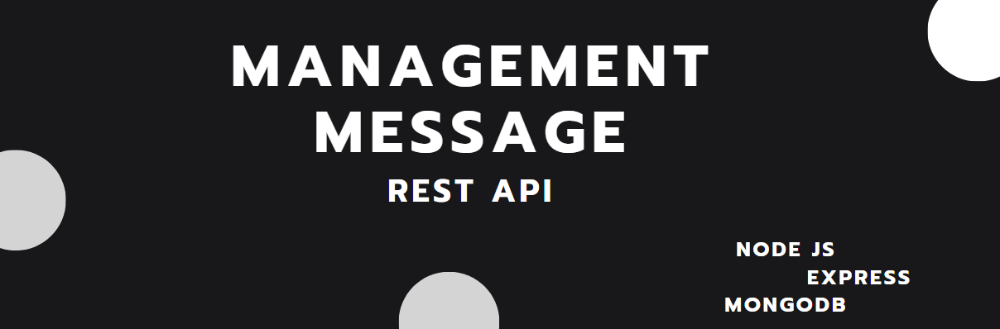

# A simple management panel for user messages, REST API With [Node](https://nodejs.org/), [Express](https://expressjs.com/), [MongoDB](https://www.mongodb.com/)



Features :

* MVC Architecture
* MongoDB & Mongoose connect, Database creation
* JsonWebToken  based authentication
* User message save on Database
* Admin management panel for user messages
* Postman testing
* Express validation

### Description

In this project I am making a simple REST API where user can send messages and admin can see/delete messages

### Install packages
```
npm i
```

### Setup .env file
``` javascript
MONGODB_URL = 
PORT = 
```

### Start the app
```
npm start
```